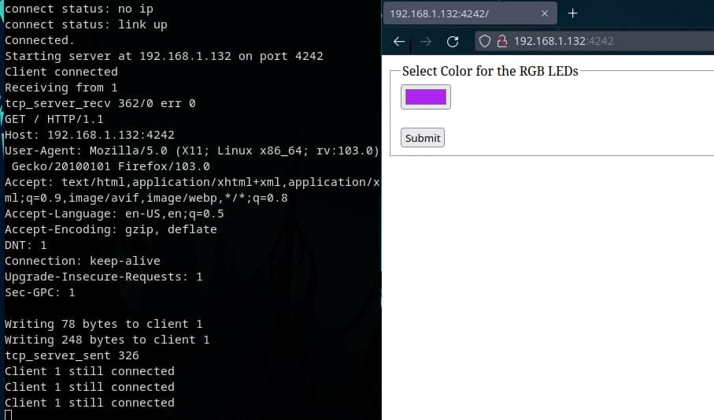

# rppico_tcpserver
* A minimalistic TCP server which accepts multiple connections and serves (but can be used for anything) a simple website.
* Pure C, no micropython
* It builds a simple http header. 
* A Python script converts html files to char* arrays, so it is simple to edit and store websites on the pico
  * Convert them with conv.py (all html files in the working dir are converted)
  * binary data is stored in websites.h
* Which website is sent to the browser is simply done by checking memcmp the GET request, making it very flexible.
* doing some benchmarking it can easily handle >100 simultaneous connections

